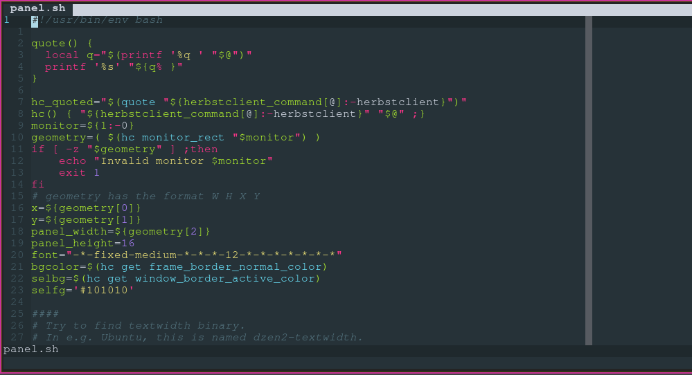
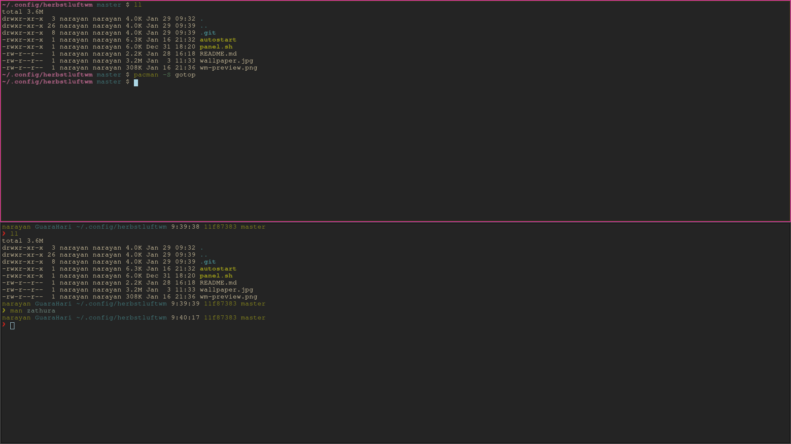
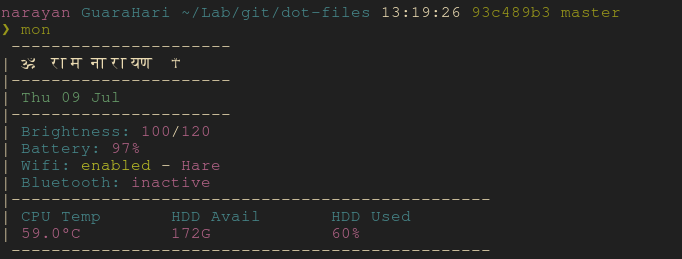

# Arch linux packages:
## pacman

```sh
github-cli fasd lsd bat ranger nvim lf python-pip ripgrep ksnip tldr
```

```sh
# Music/Media
ncmpcpp mpd mpv feh

#AUR
cava
```

```sh
#mpd
sudo gpasswd -a mpd <your login group>
sudo gpasswd -a mpd audio
#copy config
mpd

```

## AUR
```
brave-bin 
```

## Other
```
# asdf is a tool version manager for nodejs/ruby/python/elixir etc
asdf
```


# NeoVim
Requires:
- https://github.com/junegunn/vim-plug
- https://github.com/neoclide/coc.nvim/wiki/Install-coc.nvim
- https://github.com/neoclide/coc.nvim/wiki/Using-coc-extensions 

### CocInstall
requires latest nodejs version
```
:CocInstall coc-markdownlint coc-pyright coc-json coc-tsserver coc-html coc-sh
```



# Pywal

# ZSH
```sh
# Install
sudo pacman -S zsh

# Switch shell to zsh
chsh -s $(which zsh)

# Restart/Logout to take effect
```

Hikari ZSH - A pure and minimalistic zsh with special shortcuts

Copied from: https://github.com/shibumi/hikari-zsh

Default theme is the bottom terminal


## Requirements
* zsh

## Optional Requirements
* zsh-syntax-highlighting
* skim

## Installation
Just copy the `zshrc` file in your home or include it via `source <path to hikari zshrc file>`

## Visual Features
* VCS information via `zsh vcs_info`
* read-only directory warning (red path instead of blue)
* error code visualization (only green and red)
* hostname color randomization
* username colorization (normal users are green, root is red)
* syntax highlighting via zsh-syntax-highlighting
* command completion via parts of grml zsh
* git 
* colorized man pages
* includes additional minimal theme

## Overwrite configuration
Feel free to import zsh configuration before hikari via `.zshrc.pre` and
import it after hikari via `zshrc.local`.

## Additional shortcuts
### Advanced string operations
* Press `ctrl+x '` for surrounding single quotes
* Press `ctrl+x "` for surrounding double quotes
* Press `ctrl+x ;` for deleting everything inside of quotes
### Add sudo in front of every command via shortcut
* Press `ctrl+x s` for inserting sudo in front of any command
### Insert the current date into the shell
* Press `ctrl+x d` for inserting the current date
### jump after the first word to insert arguments
* Press `ctrl+x 1` to jump behind the first word to insert additional arguments
### Special behaviour with directories
* Press `ctrl+left` or `ctrl+right` to jump between full words
* Press `alt+left` or `alt+right` to jump between `/` in paths
* Press `alt+backspace` to delete until next `/` in paths
* Press `ctrl+w` to delete the whole last word
### fzf shortcuts and completion features
* Press `ctrl+t` for listing files and folders. For example: `nvim ctrl+t`
* Press `ctrl+r` for fuzzy search history
* Press `alt+c` for fuzzy change directory
* Press `ctrl+o` to open `lf`

## Additional features
* upline search
* interactive comments
* background jobs
* vcs support

# LF
#### Terminal file manager written in go
- Has depencies from `./local/bin`
  * `rotdir`
  * `lf-select`
- Has package requirements to open files
- Added shortcuts
- Added extensions to open with correct apps
- Added image previews

# Zathura
#### Terminal ebook and pdf viewer
- Added vim shortcuts

# Mon
#### Bash script to view system resources
`./local/bin/mon`


